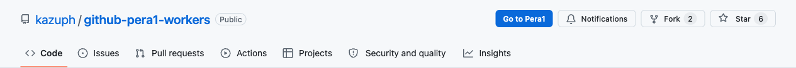
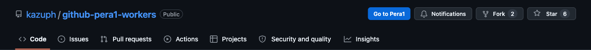
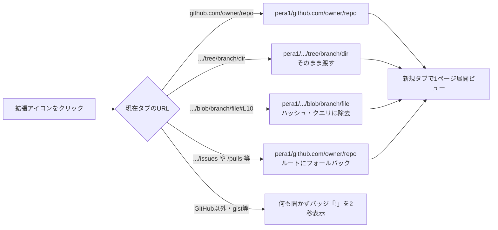
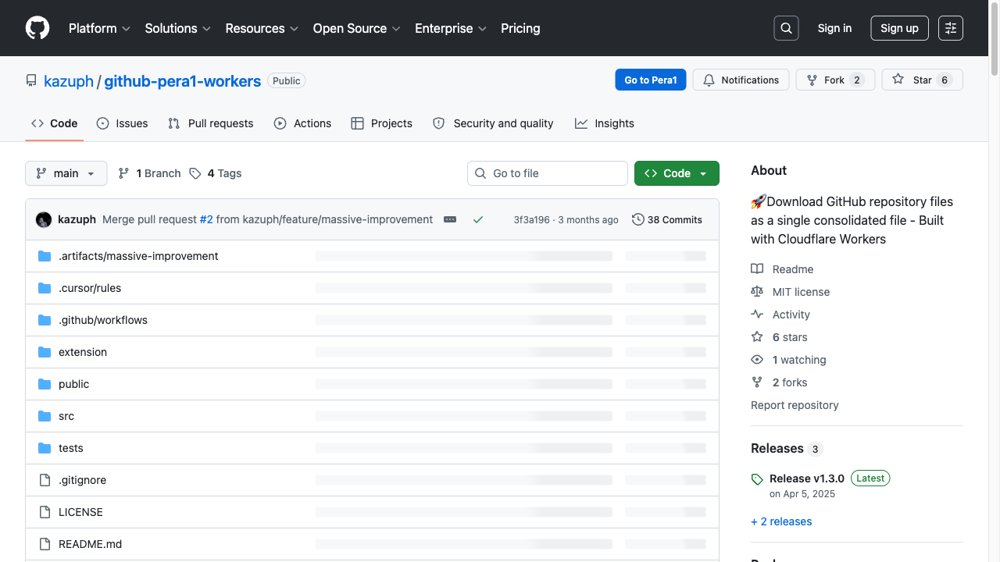
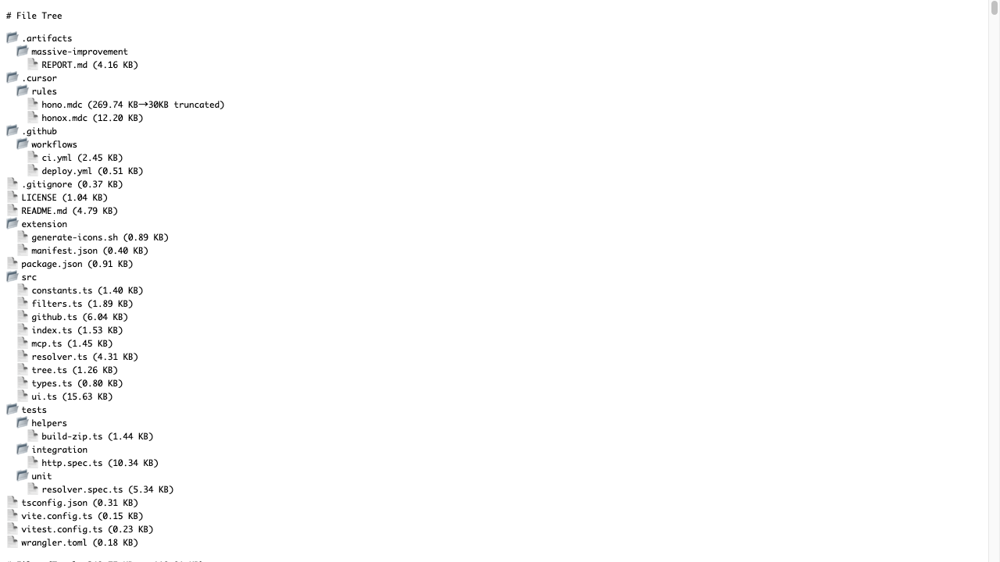

# chrome-extension / Chrome拡張ワンクリックPera1展開

Created: 2026-06-12
Branch: feature/chrome-extension
Status: Awaiting Review (Round 2)

## 🔄 User Request ⇄ Response (修正依頼と対処)

| # | User Request (原文) | Response (対処内容) | 検証方法 |
|---|---------------------|---------------------|----------|
| 1 | 「この位置のボタン微妙。」（スクショ: リポジトリ名の下に折り返して表示） | `extension/content.js` の挿入先を「リポジトリ名の横」→「Watch/Fork/Starが並ぶ `ul.pagehead-actions` の先頭」に変更。高さもGitHub小ボタンと同じ28pxに統一 | E2E: `el.closest("ul.pagehead-actions")` でアクションエリア内に配置されることをアサート。ヘッダー部のライト/ダーク両モードのスクショを取得（下記Evidence） |

### Round 2 ビフォーアフター

| Before（指摘時: タイトル下に折り返し） | After（Notifications/Fork/Starの並びに統合） |
|--------|-------|
| リポジトリ名の直下にボタンが落ちてレイアウト崩れ |  |
| （ユーザー提供スクショ参照） |  |

## 📦 依頼内容（これは何のアウトプット？）

> 「この拡張機能を開発してほしいです。chromeの拡張を押した瞬間に、githubのURLをpera1のパラメーターにしてもらい、展開したやつを表示してほしいです。」

→ **ツールバーの拡張アイコンをクリックした瞬間**、現在タブのGitHub URLを `https://pera1.kazu-san.workers.dev/github.com/...` に変換し、新規タブでコード1ページ展開ビューを開くChrome拡張（Manifest V3）を実装しました。

## 📌 Attention Required（今回の確認項目）

| # | 確認ポイント | 前提・判断材料 | 質問 |
|---|------|---------------|------|
| 1 | **Pera1のドメインを `pera1.kazu-san.workers.dev` に統一した** | wrangler.toml にカスタムドメイン設定なし。Cloudflare APIでworkers.devサブドメインが `kazu-san` であることを確認し、実際に200応答することをcurlで検証済み。既存 `extension/content.js` が向いていた `pera1.pages.dev` は**DNSすら解決しない死にホスト**だった | この統一でOK？カスタムドメインの予定があれば教えて |
| 2 | **既存の `extension/` に統合**（新規ディレクトリを作らず） | リモートmainに既に content script型（ページ内ボタン挿入）の拡張があったため、そこへ action（アイコンクリック）機能を追加する形にした。ページ内ボタンも引き続き動作する | 統合方針でOK？ |
| 3 | **Issues/PR等のページではリポジトリルートにフォールバック** | 例: `github.com/owner/repo/issues` でクリック → `pera1/github.com/owner/repo` を開く。GitHub以外のタブではバッジ「!」を2秒表示して何も開かない | この挙動でOK？ |
| 4 | **アイコンを favicon.svg 由来に刷新** | 既存の icon48/128 はImageMagick製の「P1」文字プレースホルダーだった。`public/favicon.svg`（青丸＋書類）から16/32/48/128pxを生成して統一 | 見た目OK？ |

## 🔀 変換仕様（クリック時の挙動）



## 🛠 変更前 → 変更後

| 項目 | Before | After |
|------|--------|-------|
| アイコンクリック | ❌ 何も起きない（actionなし） | ✅ **押した瞬間**Pera1の展開ビューが新規タブで開く |
| ページ内ボタンのリンク先 | ❌ `pera1.pages.dev`（DNS解決不可の死にホスト） | ✅ `pera1.kazu-san.workers.dev`（200応答を実測確認） |
| アイコン画像 | 「P1」文字のプレースホルダー（48/128のみ） | favicon.svg由来の統一デザイン（16/32/48/128） |
| URL変換テスト | なし | vitest 9ケース追加（モックなし純粋関数） |
| 拡張のE2E | なし | Playwright実ブラウザE2E（`tests/e2e/extension.e2e.mjs`） |

## 🖼 Evidence

| ① GitHubリポジトリページ（ボタンはアクションエリアに配置） | ② アイコンクリック相当 → Pera1展開ビュー |
|--------|-------|
|  |  |

①は「Go to Pera1」ボタンがNotifications/Fork/Starの並びに表示されている実GitHubページ。②はクリック後に開いた実Pera1（File Tree＋全コード展開）。**モック・スタブなし**、実GitHub・実Workerに対するE2Eのスクショです。

### Test Results

```bash
# ユニット（既存33 + 追加9 = 42件）
pnpm test
#  Test Files  3 passed (3)
#       Tests  42 passed (42)

# 型チェック
pnpm typecheck   # エラーなし

# E2E（実Chromium + 実GitHub + 実Pera1 worker）×2回連続
node tests/e2e/extension.e2e.mjs
# ✔ 拡張のservice workerがロードされた
# ✔ content scriptのボタン表示・リンク先OK
# ✔ Pera1タブが開きコードが展開された
# ✔ GitHub以外のタブでは何も開かない
# E2E ALL GREEN 🎉
```

### Verification Checklist
- [x] vitest 42件パス（既存テストも全て通過）
- [x] `tsc --noEmit` パス
- [x] Playwright E2Eを2回連続実行しflakeなし
- [x] `pera1.kazu-san.workers.dev` の死活をcurlで実測（200）
- [x] スクショを自分の目で確認

<details>
<summary>📂 変更ファイル一覧（WHAT詳細）</summary>

| ファイル | 種別 | 内容 |
|---------|------|------|
| `extension/pera1-url.js` | 新規 | GitHub URL→Pera1 URL変換ロジック（tree/blob/raw対応、予約パス処理、クエリ・ハッシュ除去） |
| `extension/background.js` | 新規 | service worker。`chrome.action.onClicked` で変換→`chrome.tabs.create`。変換不可時はバッジ「!」 |
| `extension/manifest.json` | 変更 | v1.1.0。`action` / `background`(module) / `permissions:["activeTab"]` / icons 16〜128 を追加。content_scriptsは維持 |
| `extension/content.js` | 修正 | `PERA1_HOST` を死にホスト `pera1.pages.dev` → `pera1.kazu-san.workers.dev` |
| `extension/generate-icons.sh` | 変更 | favicon.svgからrsvg-convertで4サイズ生成する方式に刷新 |
| `extension/icon{16,32,48,128}.png` | 新規/差替 | favicon.svg由来のアイコン |
| `tests/unit/extension-url.spec.ts` | 新規 | 変換ロジックのvitestユニットテスト9件 |
| `tests/e2e/extension.e2e.mjs` | 新規 | 拡張実ロードのPlaywright E2E |

権限は `activeTab` のみ（クリックした瞬間だけ現在タブのURLを読める最小権限）。`tabs` 権限や全サイトアクセスは要求しません。

</details>

<details>
<summary>⚠️ 既知の制約</summary>

- ツールバーの実クリックそのものはPlaywrightから発火できない（Chromeの仕様）ため、E2Eでは `onClicked` に渡るtabオブジェクトと同形でハンドラを直接呼んで検証。実クリックは手元での読み込み確認を推奨：
  1. `chrome://extensions` → デベロッパーモードON → 「パッケージ化されていない拡張機能を読み込む」→ `extension/` を選択
  2. GitHubの任意のリポジトリページでツールバーのPera1アイコンをクリック
- gist.github.com は Pera1 worker側が未対応のため対象外（バッジ「!」表示）

</details>

### How to Reproduce
```bash
pnpm install
pnpm test                          # ユニット42件
node tests/e2e/extension.e2e.mjs   # E2E（要playwright）
```
