# ci-deps-update / CI近代化＋依存更新（7日ルール）＋脆弱性0化

Created: 2026-06-12
Branch: feature/ci-deps-update
Status: Awaiting Review

## 📦 依頼内容（これは何のアウトプット？）

> 「CIのnodeの問題とnpmに脆弱生成がないか？古すぎないか？7日ルールで最新にするやつを1つのPRにして！」

→ ①CIのNode deprecated警告対応、②npm依存の脆弱性解消（**39件→0件**）、③**7日ルール**（公開から7日以上経過した最新版のみ採用＝サプライチェーン対策）での依存更新、を1つのPRにまとめました。さらに検証中に**本番の /mcp が warm isolate で500になる既存バグ**を発見し、修正を同梱しています。

## 📌 Attention Required（今回の確認項目）

| # | 確認ポイント | 前提・判断材料 | 質問 |
|---|------|---------------|------|
| 1 | **MCPの既存バグ修正を同梱した** | 検証中に発見：本番 `/mcp` へ連続リクエストすると3回目で500（`Already connected to a transport`）。単一McpServerに毎リクエストtransportをconnectする実装が原因で、**今の本番でも再現**（200/200/500を実測）。SDK 1.29ではこのエラーが確実に出るため、修正なしでは更新自体が成立しない | 同梱でOK？（分離するなら依存更新PRが先に進めない依存関係になる） |
| 2 | **zod 3→4 のメジャー更新を含む** | MCP SDK 1.29.0 / @hono/mcp 0.3.0 は `zod ^3.25 \|\| ^4.0` 対応を確認。実workerdで tools/list（JSONスキーマ変換）・tools/call（実GitHub取得）まで実打して成功 | OK？ |
| 3 | **CIを npm install → pnpm + frozen-lockfile に変更** | リポジトリはpnpm管理なのにCIだけ `npm install`（ロックファイル無視）だった。前PRでlockfileを同期済みなので、CIもlockfile通りに入れる方が7日ルールの固定が効く | OK？ |
| 4 | **CIのNodeを22→24（LTS）に更新** | actionsのdeprecation対応と同時に実施。ローカルは26で動作確認済み | OK？ |

## 🛡 脆弱性: 39件 → 0件

| | Before | After |
|---|--------|-------|
| **pnpm audit** | 🔴 **39件**（high 8 / moderate 28 / low 3） | 🟢 **0件**（No known vulnerabilities found） |
| 主な原因 | hono 4.7.5（JWT等の既知脆弱性）、MCP SDK 1.17.4配下の古いexpress系 | 直接依存の更新＋transitive 2件（path-to-regexp 8.4.0 / qs 6.15.2）はpnpm overridesで強制 |

## 📅 依存更新（7日ルール: 2026-06-05以前に公開された最新版のみ採用）

| パッケージ | Before | After | 公開日 | 最新版を見送った理由 |
|---|---|---|---|---|
| hono | 4.7.5 | **4.12.23** | 2026-05-25 | 4.12.25は06-09公開＝7日未満 |
| zod | 3.25.76 | **4.4.3** | 2026-05-04 | （4.4.3が最新） |
| @modelcontextprotocol/sdk | 1.17.4 | **1.29.0** | 2026-03-30 | （1.29.0が最新） |
| @hono/mcp | 0.1.1 | **0.3.0** | 2026-05-16 | （0.3.0が最新） |
| @cloudflare/workers-types | 4.20250405.0 | **4.20260605.1** | 2026-06-05 | 4.20260612.1は当日公開 |
| @typescript/native-preview | dev.20260326.1 | **dev.20260604.1** | 2026-06-04 | dev.20260611.2は7日未満 |
| path-to-regexp (transitive) | 8.2.x | **8.4.0** (override) | 2026-03-26 | DoS脆弱性パッチ版 |
| qs (transitive) | 6.13.x | **6.15.2** (override) | 2026-05-16 | DoS脆弱性パッチ版 |
| wrangler / vite / vitest / typescript / @cloudflare/vite-plugin / jszip | — | **据え置き** | — | 既に「7日ルール内の最新」（より新しい版は7日未満 or 存在せず） |

## ⚙️ CI workflow の変更（Node 20 deprecated 対応）

| 項目 | Before | After | 7日ルール確認 |
|---|---|---|---|
| actions/checkout | v4（Node20系・deprecated） | **v6** | v6.0.3 公開 2026-06-02 ✓ |
| actions/setup-node | v4（同上） | **v6** | v6.4.0 公開 2026-04-20 ✓ |
| actions/github-script | v7（同上） | **v9** | v9.0.0 公開 2026-04-09 ✓ |
| pnpm/action-setup | （なし） | **v6** 新規 | v6.0.8 公開 2026-05-12 ✓ |
| Node.js | 22 | **24（LTS）** | — |
| インストール | `npm install`（lockfile無視😱） | `pnpm install --frozen-lockfile` | — |

## 🐛 同梱バグ修正: /mcp が warm isolate で500

```mermaid
flowchart LR
    subgraph Before["Before（本番で実測: 200/200/500）"]
        A1[リクエスト1] --> S1[単一のmcpServer<br/>connect 1回目 OK]
        A2[リクエスト2<br/>同じisolate] --> S2["connect 2回目<br/>💥 Already connected"]
    end
    subgraph After["After（実測: 200/200/200）"]
        B1[リクエスト1] --> C1[createMcpServer&#40;&#41;<br/>毎回新インスタンス]
        B2[リクエスト2] --> C2[createMcpServer&#40;&#41;<br/>毎回新インスタンス]
    end
```



- `src/mcp.ts`: `export const mcpServer` → `export function createMcpServer()` ファクトリ化
- `src/index.ts`: `/mcp` ルートでリクエスト毎に生成
- `tests/integration/http.spec.ts`: **Test 6b** として連続initialize×3が全部200になるregressionテストを追加

## ✅ Evidence（検証ログ）

### テスト・ビルド・監査
```bash
pnpm install --frozen-lockfile  # CIと同条件 → OK
pnpm typecheck                  # エラーなし
pnpm test                       # Test Files 3 passed / Tests 43 passed（regression含む）
pnpm build                      # ✓ built
pnpm audit                      # No known vulnerabilities found
node tests/e2e/extension.e2e.mjs  # E2E ALL GREEN（拡張も無事）
```

### 実workerd（wrangler dev）での実打
```bash
# tools/list → zod4のJSONスキーマ変換成功（inputSchema が正しく出力される）
# tools/call → 実GitHubから File Tree 取得成功
# 連続initialize×3 → try1: 200 / try2: 200 / try3: 200
# （比較: 現在の本番 https://pera1.kazu-san.workers.dev/mcp は try3 で 500）
```

### Verification Checklist
- [x] 脆弱性 39件→0件（pnpm audit実測）
- [x] 全更新パッケージの公開日を npm registry で実測し7日ルール適合を確認
- [x] vitest 43件パス（regressionテスト追加込み）／ tsc クリーン ／ build成功
- [x] 実workerdでMCPフルフロー（initialize→tools/list→tools/call）実打成功
- [x] 本番の /mcp 500バグを実測で確認した上で修正・regressionテスト追加
- [x] CIと同条件の frozen-lockfile インストール成功

<details>
<summary>⚠️ 備考・スコープ外</summary>

- マージ後、deploy.yml が本番デプロイするので `/mcp` バグ修正も自動で本番反映される
- gist対応やhono 4.12系の新機能追従はスコープ外
- 今後 `pnpm audit` をCIに組み込む案もあり（今回は入れていない。希望あれば追加）

</details>
