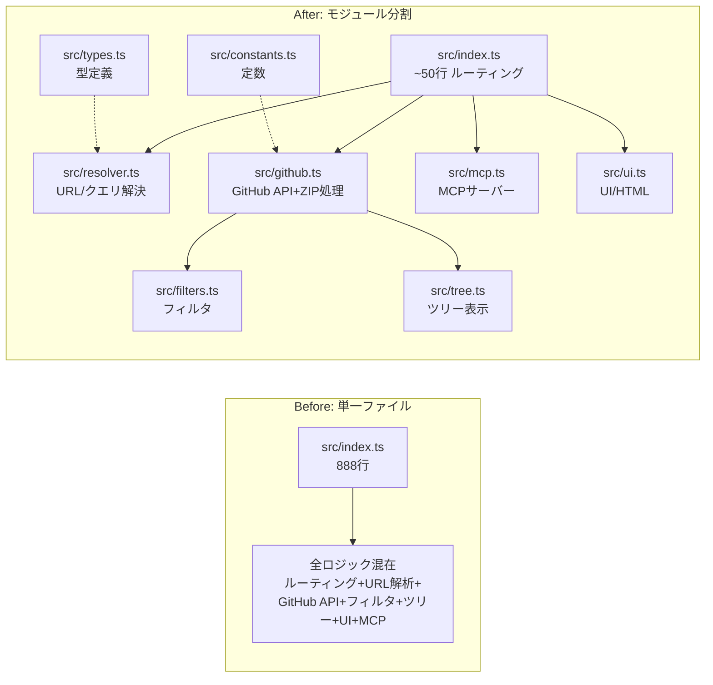
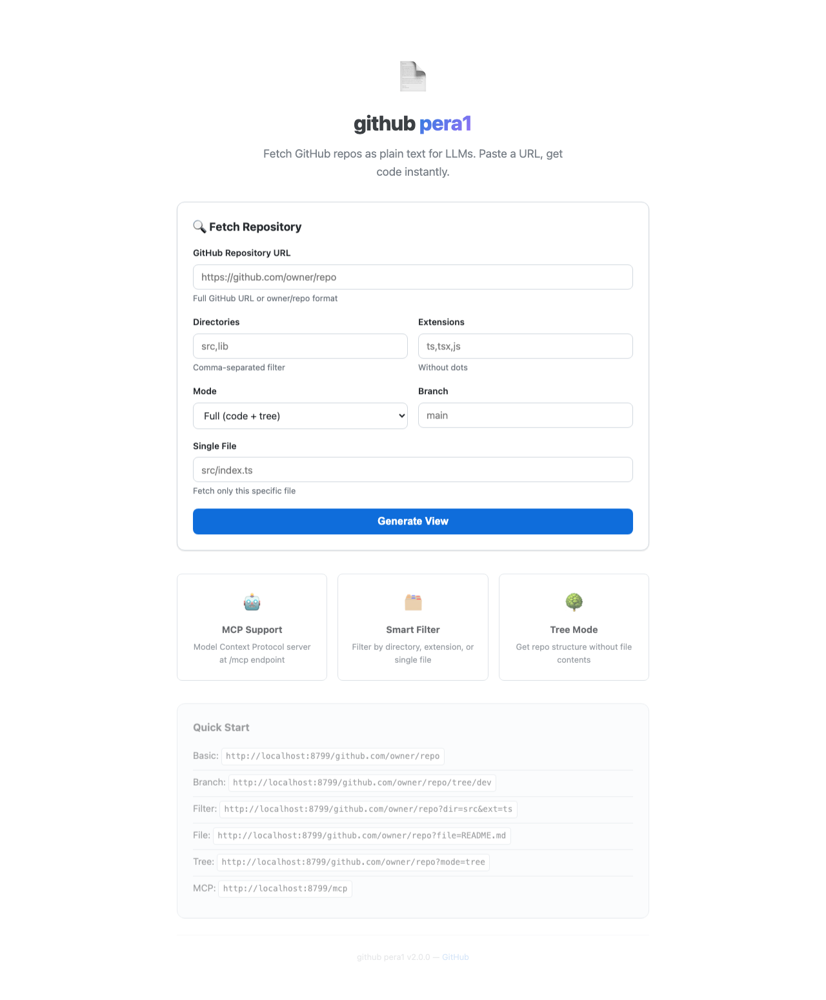
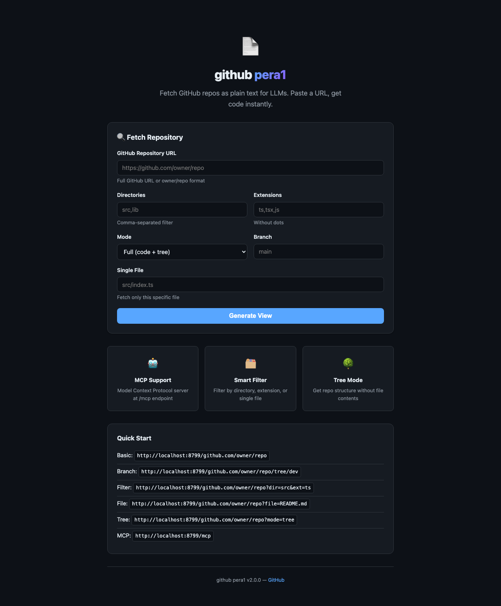
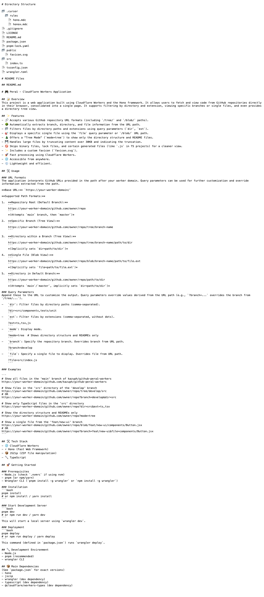

# 大規模コード改善レポート

## Summary

github-pera1-workersの大規模改善を実施。888行の単一ファイルをモジュール分割し、UIをモダン化、開発ツールチェーンを刷新、Chrome拡張を新規作成。

## 構造変更（Before / After）

## 変更ファイル一覧

| ファイル | 変更種別 | 説明 |
|---------|---------|------|
| `src/index.ts` | 書き換え | 888行 → ~50行のルーティング薄層 |
| `src/types.ts` | 新規 | FileEntry, GitHubRepositoryParams, ParsedGitHubUrl, ResolvedRequest |
| `src/constants.ts` | 新規 | 定数定義（サイズ制限、拡張子リスト、キャッシュ設定） |
| `src/filters.ts` | 新規 | バイナリ判定、スキップ判定、インクルード判定 |
| `src/tree.ts` | 新規 | ディレクトリツリー表示生成 |
| `src/github.ts` | 新規 | GitHub ZIP取得・展開・フォーマット |
| `src/resolver.ts` | 新規 | URL解析+クエリパラメータ結合ロジック |
| `src/mcp.ts` | 新規 | MCPサーバー定義 |
| `src/ui.ts` | 新規 | モダンランディングページ（ダークモード対応） |
| `vite.config.ts` | 新規 | Cloudflare Vite Plugin設定 |
| `wrangler.toml` | 更新 | compatibility_date更新、nodejs_compat追加 |
| `package.json` | 更新 | v2.0.0、Vite/tsgo追加、scripts更新 |
| `extension/manifest.json` | 新規 | Chrome拡張 Manifest V3 |
| `extension/content.js` | 新規 | GitHub上に「Go to Pera1」ボタン挿入 |

## 改善内容

### 1. モジュール分割
- 888行の巨大index.tsを8つの専門モジュールに分割
- 各モジュールの責務が明確（Single Responsibility）
- テスト可能な純関数として切り出し

### 2. UI/UX大改善
- CSS変数によるテーマ管理
- `prefers-color-scheme`でダークモード自動対応
- レスポンシブデザイン（モバイル対応）
- フェードイン/スライドアップアニメーション
- URLコピーボタン
- ローディング状態表示
- 特徴紹介セクション（MCP、フィルタ、ツリーモード）

### 3. 開発ツールチェーン
- **Vite + @cloudflare/vite-plugin**: `vite dev`で開発、`vite build`でビルド
- **tsgo (TypeScript 7.0 native preview)**: Go製の超高速型チェッカー
- **wrangler**: 引き続き直接デプロイにも対応

### 4. Chrome拡張「Go to Pera1」
- GitHubリポジトリページでリポ名横にボタン表示
- クリックでPera1のURLに直接ジャンプ
- MutationObserverでGitHubのSPA遷移にも対応

### 5. パフォーマンス・品質
- Cache-Controlヘッダー追加（成功: 10分、エラー: 1分）
- compatibility_dateを最新に更新
- nodejs_compatフラグ追加（jszip依存のNode.js API対応）

## スクリーンショット

### ランディングページ（ライトモード）

### ランディングページ（ダークモード）

### リポジトリ取得結果（Tree Mode）

## テスト結果

- [x] TypeScript型チェック（tsc --noEmit）: パス
- [x] tsgo型チェック: パス
- [x] wrangler dry-run build: パス
- [x] Vite dev server起動: 正常
- [x] ルートページ（/）: 200 OK
- [x] リポジトリ取得（?mode=tree）: 200 OK
- [x] MCPエンドポイント（/mcp）: 406 (想定通り - POST必要)
- [x] エラーページ: 正常表示
